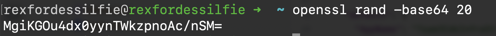
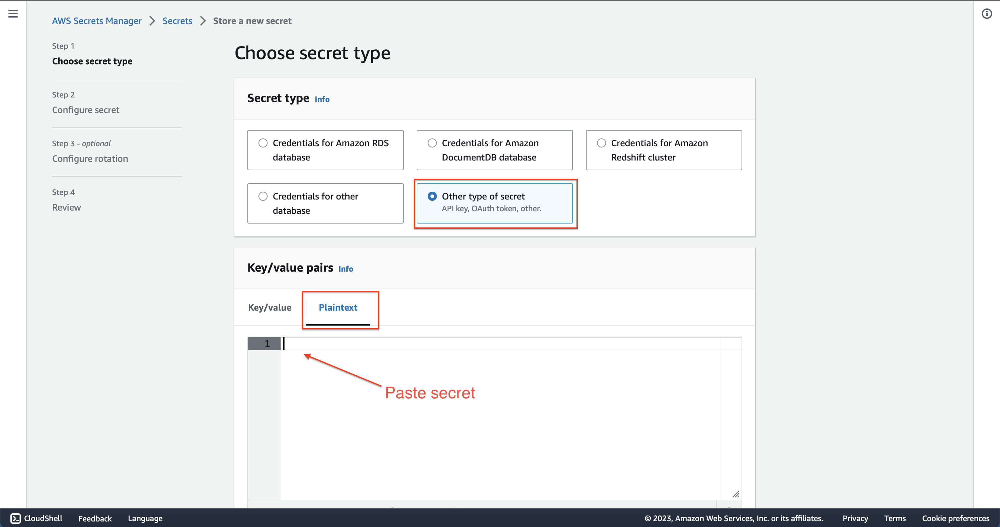
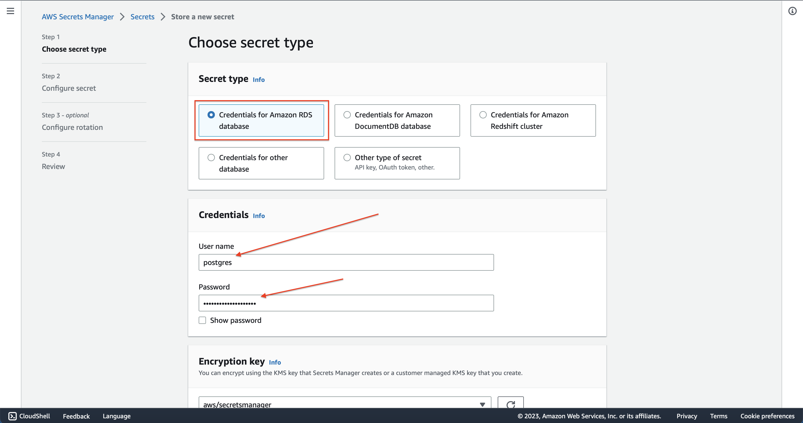
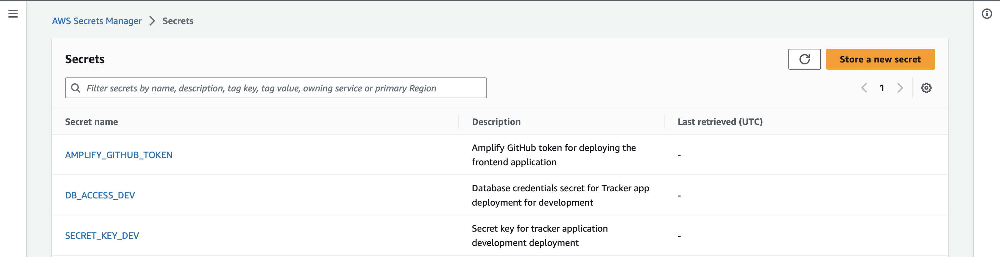
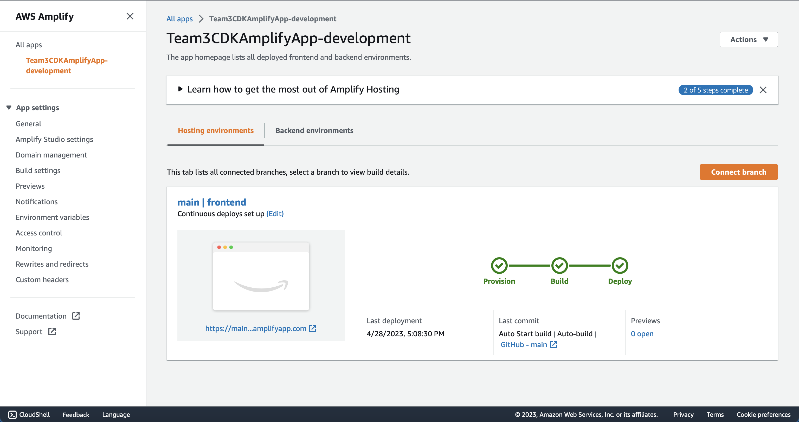

# Deployment

These are instructions to deploy the backend. The backend is deployed to AWS Lambda with AWS API Gateway, and uses AWS RDS for the database.

## Introduction
The backend is deployed using the AWS Cloud Development Kit (CDK). The CDK is an open-source software development framework to define cloud infrastructure in code and provision it through AWS CloudFormation.

As in the README.md for `cdk-infra`, the CDK has been setup to deploy the following resources:
1. Dockerized `backend` application Image to AWS ECR
2. AWS Lambda Function that executes Dockerized Image above
3. AWS (REST) API Gateway that exposes the Lambda Function
4. AWS Amplify Application that builds and hosts the `frontend` web application

## Prerequisites

Here are some prerequisites for being able to use the CDK to deploy the application:

1. [Create an AWS Account](https://docs.aws.amazon.com/accounts/latest/reference/manage-acct-creating.html)
2. [Create an AWS IAM User](https://docs.aws.amazon.com/IAM/latest/UserGuide/id_users_create.html) and [Assign an Access Key](https://docs.aws.amazon.com/IAM/latest/UserGuide/id_credentials_access-keys.html#Using_CreateAccessKey)
3. [Install](https://docs.aws.amazon.com/cli/latest/userguide/cli-chap-install.html) and [Configure](https://docs.aws.amazon.com/cli/latest/userguide/cli-chap-configure.html) AWS CLI
4. [Install](https://docs.aws.amazon.com/cdk/v2/guide/getting_started.html#getting_started_install) and [Bootstrap](https://docs.aws.amazon.com/cdk/v2/guide/getting_started.html#getting_started_bootstrap) the AWS CDK


## Deployment Setup
For this project, all the logic for managing deployment with CDK is in the `cdk-infra` directory. From inside this directory, we can run the commands in the next section to create the CloudFormation templates describing the resources we want to deploy, and then deploy them to AWS.

## Process
1. Synthesize the CloudFormation template for the desired environment
    ```bash
    cdk synth -c app_env=<environment>
    ```
2. Check differences between the synthesized template and the deployed stack
    ```bash
    cdk diff -c app_env=<environment>
    ```
3. Deploy the CloudFormation template for the desired environment
    ```bash
    cdk deploy -c app_env=<environment>
    ```


## Secrets
The deployment relies on setting up some secrets in AWS Secrets Manager. These secrets are used to set the environment variables for the Lambda Function. These secrets are discussed in detail inside of the `cdk-infra` directory in the `README.md` file.

For a visualization of how to set up the secrets, here are some images you can follow:

**Generating a Secret Token via Terminal**


**Adding a Plaintext Secret**


**Adding RDS Secret**


**After Setting All Secrets**


**Amplify Dashboard after Deployment**

